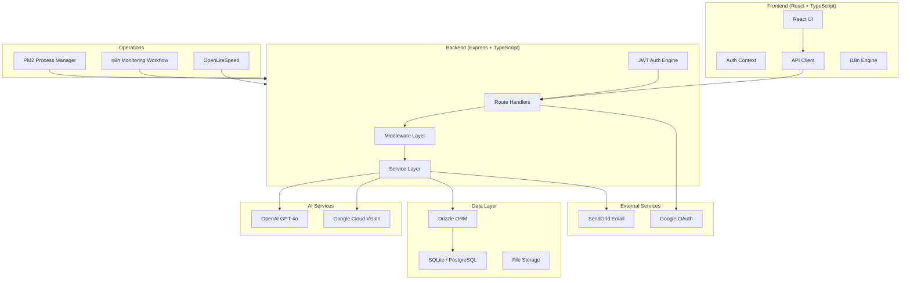
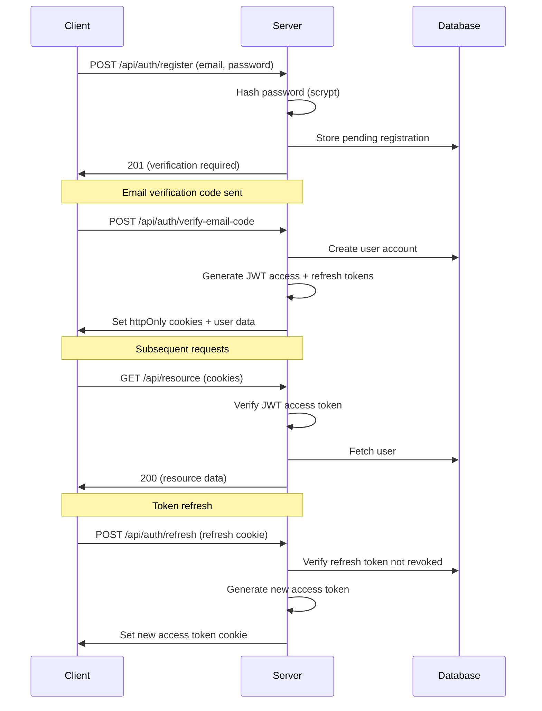

# NutriAI System Architecture

## Overview

NutriAI is a client-server application with an AI-powered backend serving a React frontend. The system integrates multiple AI services for food recognition, meal planning, and nutritional coaching.

## System Diagram

## Authentication Flow

## Key Design Decisions

### JWT + Refresh Token Architecture
- **Access tokens** expire in 1 day (short-lived, stateless)
- **Refresh tokens** expire in 365 days (long-lived, stored in DB, revocable)
- Both tokens stored in **httpOnly cookies** (immune to XSS)
- Refresh tokens are tracked in the database for revocation support

### SQLite for Development, PostgreSQL for Production
- SQLite provides zero-config local development
- Drizzle ORM abstracts the database layer for portable schema
- Production deployments use PostgreSQL (Neon serverless)

### AI Service Architecture
- All AI calls go through a **service manager** that handles token tracking, cost management, and rate limiting
- Per-user token limits prevent runaway costs
- Cron jobs reset daily/monthly usage counters

### Rate Limiting Strategy
- Registration: 3 attempts per email per 15 minutes
- Login: 10 attempts per IP per 15 minutes
- Password reset: 3 attempts per email per hour
- Verification codes: 5 attempts per 15 minutes

## API Structure

| Route Group | Base Path | Auth | Description |
|-------------|-----------|------|-------------|
| Auth | `/api/auth/*` | Public | Registration, login, token management |
| User | `/api/user/*` | JWT | Profile management |
| Food | `/api/food-logs/*` | JWT | Food logging and tracking |
| Recipes | `/api/recipes/*` | JWT | Recipe CRUD and generation |
| Meal Plans | `/api/meal-plans/*` | JWT | Meal plan management |
| AI | `/api/ai-coach/*` | JWT | AI coaching conversations |
| Admin | `/api/admin/*` | JWT + Admin | User management, analytics |
| Monitoring | `/api/monitoring/*` | API Key | System health and metrics |

## Database Schema (Key Tables)

| Table | Purpose |
|-------|---------|
| `users` | User accounts, auth data, gamification stats |
| `user_nutrition_preferences` | Dietary goals, restrictions, body metrics |
| `food_logs` | Daily food intake tracking |
| `recipes` | User-created and AI-generated recipes |
| `meal_plans` | Weekly meal planning |
| `weight_logs` | Weight tracking history |
| `progress_photos` | Body progress photo tracking |
| `refresh_tokens` | JWT refresh token storage and revocation |
| `api_usage_tracking` | Per-user AI API usage tracking |
| `user_token_limits` | Per-user rate limiting tiers |

## Monitoring

The system includes a comprehensive monitoring setup via n8n workflows:

- **Critical Monitor** (30s interval) — Overall health score, service status
- **Service Monitor** (2min) — PM2 process health, CPU/memory per service
- **VPS Monitor** (5min) — Server resources (CPU, RAM, disk, network)
- **Error Monitor** (10min) — Log analysis and pattern detection
- **Attack Monitor** (5min) — Registration abuse detection

Each monitor feeds data to an AI agent (GPT-4o-mini) for analysis, which determines severity and triggers email alerts for critical/warning conditions.
